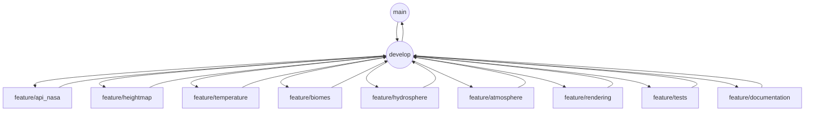

ORGANISATION DES TÂCHES ET DU TRAVAIL EN BINÔME – PHACAV
Binôme : Jonathan & Andy
Période : du 10 au 13 juin 2025
Structure Git : GitLab, flux GitFlow

1. Structure des branches (adaptée)

Le projet suit une organisation en branches selon le modèle GitFlow adapté :

- main : branche stable pour le rendu final de la soutenance
- develop : branche de consolidation avant passage en production
- feature/api_nasa : récupération des données exoplanétaires (Andy)
- feature/temperature : calcul des températures (Andy)
- feature/biomes : génération des biomes (Andy)
- feature/heightmap : génération de la heightmap (Jonathan)
- feature/hydrosphere : détection des zones immergées (Jonathan)
- feature/atmosphere : simulation atmosphérique (Jonathan)
- feature/rendering : assemblage visuel final (Jonathan)
- feature/tests : tests unitaires et d'intégration
- feature/documentation : documentation technique et fonctionnelle

2. Répartition concrète des tâches

Jonathan :
- Développe les modules : heightmap, hydrosphere, atmosphere, rendering
- Crée les tests associés
- Maintient la documentation technique

Andy :
- Développe les modules : api_nasa, temperature, biomes
- Crée les tests associés
- Rédige le README et la documentation fonctionnelle

Binôme :
- Centralise les modules dans generate_planet.py (branche develop)
- Nettoie le dépôt, prépare le plan oral et les tests manuels
- Maintient le fichier .gitlab-ci.yml

3. Déroulement des merges

1. Chaque membre développe sur sa branche feature correspondante.
2. À chaque fin de fonctionnalité stable, il pousse et ouvre une merge request vers develop.
3. Le binôme relit et valide la MR (review croisée recommandée).
4. Une fois tous les modules testés et validés, develop est fusionnée dans main la veille de la soutenance.
5. Aucun développement direct ne se fait sur main.

4. Règles de collaboration

- Une branche = une fonctionnalité = une issue
- Commits clairs et structurés
- README et documentation maintenus à jour
- Toute nouvelle fonctionnalité passe par develop
- Tests automatisés via GitLab CI sur chaque MR

5. Dossier Livrables

Le dossier Livrables/ contient :
- TEST_PLAN
- WORKFLOW
- Diagrammes UML (Mermaid)
- Export PNG ou 3D de la planète générée
